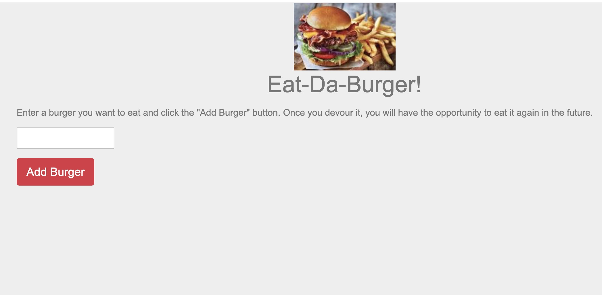
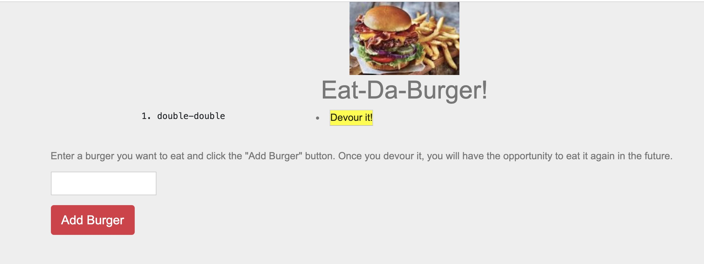
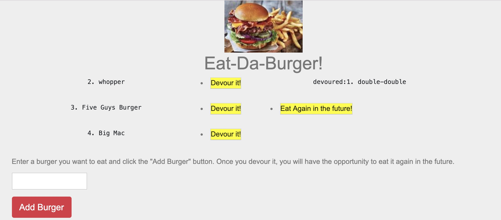
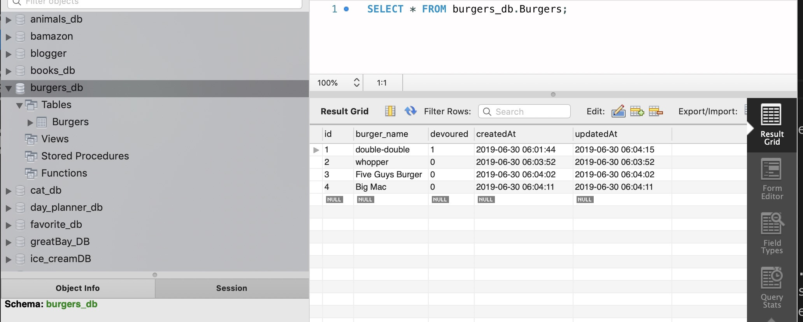

# sequelizedBurger
Eat-Da-Burger! is a restaurant app that lets users input the names of burgers they'd like to eat.

* Whenever a user submits a burger's name, the app will display the burger on the left side of the page -- waiting to be devoured. Each burger in the waiting area also has a `Devour it!` button. When the user clicks it, the burger will move to the right side of the page.

* If a user would like to eat the burger again in the future, user will click the "Eat Again in the future! button and the app will display the burger on the left side of the page -- waiting to be devoured. 

* The app will store every burger in a database, whether devoured or not.

This app requires the following dependencies located in package.json in order to run: express, express-handlebars, mysql2, sequelize. In the config.json file, also update the password to reflect your own password and port for accessing the SQL database.